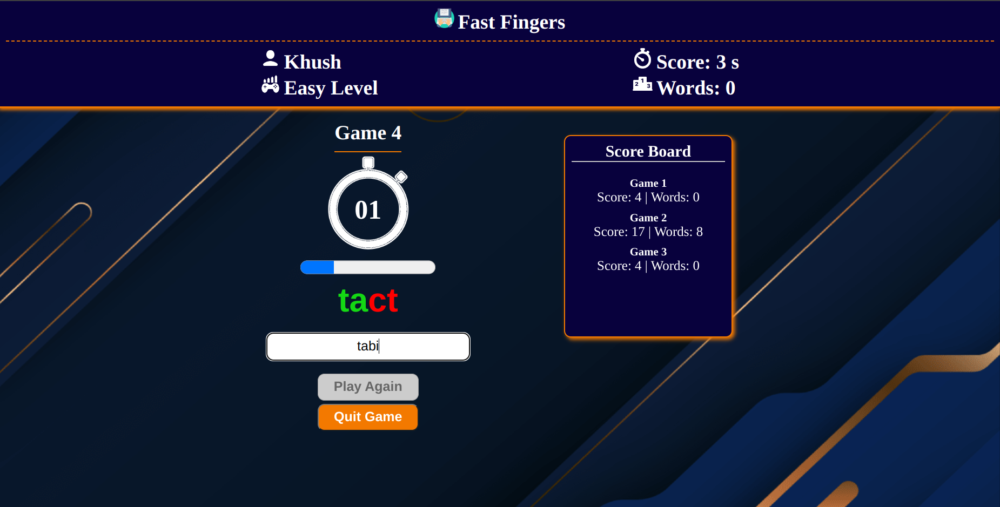

## Fast Fingers : An awesome speed typing game to test your skills!
  <a href="https://khush-fast-fingers.netlify.app/"><strong>LIVE DEMO »</strong></a>
   

<!-- ABOUT THE PROJECT -->
## About The Project

Welcome to Fast Fingers, the ultimate speed typing web application game! Test your typing skills and challenge yourself across three exciting modes: Easy, Medium, and Difficulty. Whether you're a beginner or a typing pro, there's a mode for you.

Fast Fingers not only measures your typing speed but also keeps track of your accuracy, helping you improve with each game. Race against the clock to type out as many words as you can accurately within the given time frame.

With its sleek interface and engaging gameplay, Fast Fingers is the perfect way to sharpen your typing skills while having fun. Are you ready to become the fastest typist around? Play Fast Fingers now and see how quick your fingers can fly!

 

### Built With

   
   
   
   
   

<!-- MARKDOWN LINKS & IMAGES -->
<!-- https://www.markdownguide.org/basic-syntax/#reference-style-links -->
[contributors-shield]: https://img.shields.io/github/contributors/othneildrew/Best-README-Template.svg?style=for-the-badge
[contributors-url]: https://github.com/othneildrew/Best-README-Template/graphs/contributors
[forks-shield]: https://img.shields.io/github/forks/othneildrew/Best-README-Template.svg?style=for-the-badge
